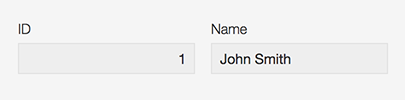
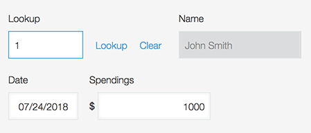
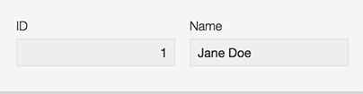
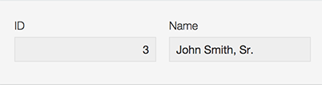
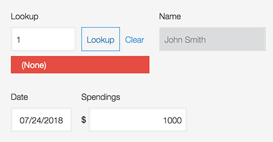

# Automatic Lookup Update Plugin for Kintone
## Download

## The Problem
Currently, Kintone’s native lookup field allows users to fill in record information with the data from a record in another app, but it does so by simply copying over the record’s data once when the initial lookup is performed.

As such, if users later change the data of the lookup source, they must manually relookup the record in order to copy over the new data.

Furthermore, if users change the value being used as the key value of the lookup, the lookup will no longer be able to find the corresponding record.

## Our Solution
Our plugin automates lookup updates. In essence, we are changing Kintone from a non-relational database into a relational database. It even works in complex cases, such as a chain of lookups, where one lookup gets data from another lookup’s mapped field.

### Use-case Example
The user has an app called Drivers which contains a “Name” [text] and “License Plate Number” [number] field. The user has another app called Car Info which contains “License Plate Number” [Lookup into Drivers->License Plate Number], “Color” [text], and “Model” [text] fields. When the user changes a record’s “License Plate Number” field in Drivers, the corresponding record(s) in Car Info is updated such that their “License Plate Number” field matches the new number.

## How to Get Started

### Installation
1. Download the LookupUpdatePlugin.zip file and upload it to your Kintone subdomain.
2. Next, install the plugin in every app that is being __looked up from__. For instance, if app B has a lookup field with source app A, install the plugin in app A. And if app C has a lookup field with source B, install the plugin in app B as well.
3. Create an app from scratch named “Map Source” (must be an exact match) and add a Text Area field with field code  “mapAsJSON”. Publish the app.
4. Test the plugin by first editing and saving any existing record in any app that has the plugin installed. Wait for the spinning icon to disappear. Then, refresh the page in Map Source. A new nonempty record should have been created.
5. The installation is finished!

### Usage Notes
- After you click save, please wait until the spinning icon disappears. Do not leave or refresh the page while you see the spinning icon.
- Remember that if you ever change/add/delete an app’s fields, you __must delete__ Map Source’s automatically generated record. It will then be automatically regenerated when you edit and save an existing record in an app that has the plugin installed.

## Limitations
*This plugin will not work if you have any apps that contain a lookup field with another __lookup field__ set as its __key field__.

*This plugin will not work if any single app contains __multiple lookup fields__ that lookup from the __same source app__.

*If a source app’s record is deleted, the change will not propagate through the child apps. The child apps will not change at all, exactly as it would behave in Kintone without the plugin installed.

## Troubleshooting
*Generally, if something that used to work doesn’t work anymore, you should try deleting the record in your Map Source app, and testing it again.

*If the updates aren’t happening, you may have forgotten to install the plugin in an app. See Installation above to make sure you have it installed correctly. If you have an especially complex set of apps, you might find it helpful to draw out a map of lookups. See below for examples we drew.

## Further Help
We do not work for Kintone and we developed this software to be freely available for all. We’re also college students so please donate if you can! If you need help, contact Kintone support. If you have any suggestions or feedback, email us at
__kintonedevs [at] gmail [dot] com__
